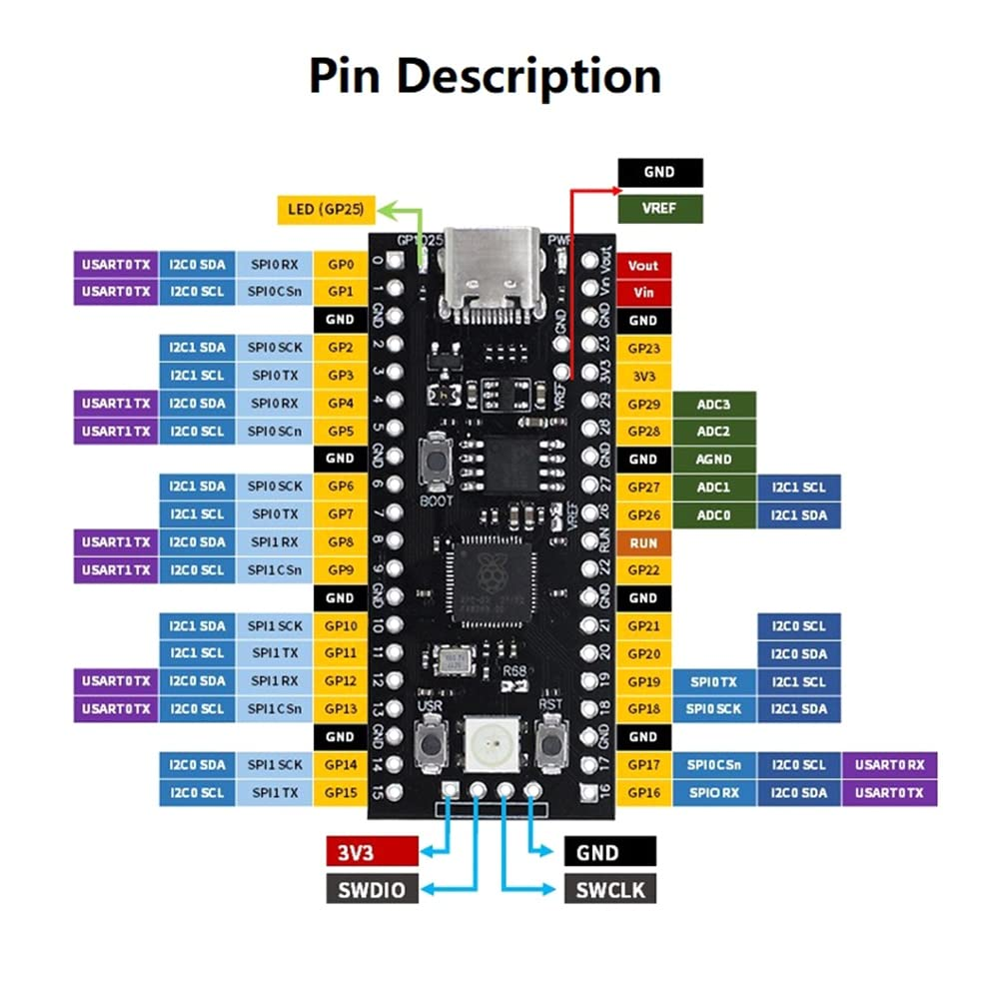

# Chapter 2: Arduino言語での "Hello, World"とLEDの点滅

## Arduino言語の基本構造

マイコンプログラミングを始めるにあたり、まずは基本となるプログラムの構造を理解しましょう。Arduino言語のプログラムは、主に2つの関数で構成されています。

```cpp
void setup() {
    // 初期化処理：電源投入後に一度だけ実行される
}

void loop() {
    // メイン処理：setup()の実行後、繰り返し実行され続ける
}
```

`setup()`関数は、マイコンのピン設定や通信の初期化など、プログラムの開始時に一度だけ行いたい処理を記述する場所です。一方、`loop()`関数には、マイコンが動作し続ける限り、繰り返し実行したいメインの処理を記述します。この`loop()`が無限に繰り返される構造こそが、外部からの入力に応答し続けたり、制御を続けたりするマイコンプログラミングの基本です。

## マイコンのピン配置を理解する

電子工作では、マイコンの「ピン」と呼ばれる足を通して、LEDやセンサーといった電子部品と信号のやり取りを行います。そのため、どのピンがどのような機能を持っているかを知ることが、回路設計の第一歩となります。



このピン配置図は、いわばマイコンの機能を示した地図です。すべてのピンの役割を一度に覚える必要はありませんが、回路を組む際には必ずこの図を参照し、正しいピンに接続する習慣をつけましょう。

特に重要なのは、以下の3種類のピンです。

-   **GND (グラウンド)**: 回路全体の基準となる0Vのピンです。回路を組む上で、電源のプラス側とマイナス側を正しく接続することが基本であり、GNDはこのマイナス側にあたります。
-   **電源ピン (3V3など)**: 3.3Vなどの安定した電圧を外部に供給するピンです。センサーなどの部品を動作させるための電源として利用します。
-   **GP〇〇 (GPIO)**: `GP0`や`GP13`といった番号付きのピンです。GPIOは "General Purpose Input/Output" の略で、プログラムからデジタル信号の入力・出力の両方に使える汎用的なピンです。LEDの点灯制御やスイッチの状態読み取りなど、電子工作の多くは、このGPIOピンを介して行われます。

## Serial通信でマイコンの動作を確認する

マイコンはPCと違ってディスプレイを持たないため、プログラムが意図通りに動いているか、変数の値がどうなっているかなどを直接見ることができません。そこで、PCとマイコンをUSBケーブルで接続し、テキストデータを送受信して動作状況を確認する**Serial通信**が、開発において極めて重要な役割を果たします。

```cpp
void setup() {
    // Serial通信を開始し、通信速度を115200 bpsに設定する
    Serial.begin(115200);
}

void loop() {
    // PCに "Hello, World!" という文字列を送信する
    Serial.println("Hello, World!");
    // 1秒間待機する
    delay(1000);
}
```
`Serial.println()`は、プログラムのデバッグ（問題解決）において、最もシンプルかつ強力なツールの一つです。マイコン内部の状態を知るための「窓」として、積極的に活用していきましょう。

<details>
<summary><b>補足：</b>クラスという概念</summary>
`Serial`は、Arduinoフレームワークにあらかじめ用意されている「クラス」の一例です。クラスとは、特定の機能に関連する変数や関数を一つにまとめたもので、複雑な処理を簡単な命令で扱えるようにしてくれます。例えば`Serial.println()`という命令一つで、実際にはUSBドライバとのデータのやり取りなど、多くの低レベルな処理が内部的に行われています。こうした便利な「道具」の存在を理解しつつも、その裏側で何が行われているのかを少し想像してみることが、より深い理解に繋がります。
</details>

## Lチカで学ぶ、回路設計の基礎

「Lチカ」（LEDを点滅させること）は、電子工作の入門として非常に有名です。しかし、ただサンプルコードを書き写してLEDを光らせるだけでは、学びは浅いものになってしまいます。この課題の本当の目的は、**なぜその回路で正しく動作するのか**を理解し、**自分で回路を設計するための基礎を学ぶ**ことにあります。

### なぜ電流制限抵抗が必要なのか
LEDは、一定の電圧（順方向電圧, V<sub>F</sub>）を超えると急激に電流が流れる特性を持っています。もし、マイコンのGPIOピン（Picoの場合は3.3V）にLEDを直接接続すると、LEDの許容電流を大幅に超える電流が流れ、LEDは一瞬で破損してしまいます。

この過大な電流を防ぎ、LEDを安全に光らせるために、**電流制限抵抗**を直列に接続する必要があります。この一手間を惜しまないことが、電子部品とマイコンを安全に扱うための基本です。

### オームの法則を用いた抵抗値の計算
適切な抵抗値は、電気の基本法則である**オームの法則** `電圧(V) = 電流(I) × 抵抗(R)` を使って計算できます。

式を変形すると `抵抗(R) = 電圧(V) / 電流(I)` となります。ここで、各値は以下のように考えます。

-   **電圧(V)**: 抵抗にかかる電圧。これは、マイコンのピン電圧(3.3V)から、LED自身が消費する電圧（赤色LEDの場合、約2.0V）を引いた値です。 `1.3V = 3.3V - 2.0V`
-   **電流(I)**: LEDに流したい電流。LEDのデータシート上の最大定格よりも余裕を持たせた値、例えば**15mA (0.015A)**程度が安全です。

これらの値を式に代入すると、`R = 1.3V / 0.015A = 86.67Ω` となります。
この値と完全に一致する抵抗は一般的に販売されていないため、これよりも少し大きい、入手しやすい**100Ω**や**220Ω**といった抵抗を選択します。この計算と思考のプロセスが、回路設計の第一歩です。

## マイコンからLEDを制御する

理論を学んだところで、実際にLEDを点滅させるプログラムを書いてみましょう。

（ここに回路図を挿入）

```cpp
#define LED_PIN 15 // LEDを接続するピン番号を13と定義

void setup() {
    // LED_PINを出力モードに設定
    pinMode(LED_PIN, OUTPUT);
}

void loop() {
    digitalWrite(LED_PIN, HIGH); // ピンの電圧をHIGH(3.3V)にしてLEDを点灯
    delay(1000);                 // 1000ミリ秒(1秒)待機
    digitalWrite(LED_PIN, LOW);  // ピンの電圧をLOW(0V)にしてLEDを消灯
    delay(1000);                 // 1000ミリ秒(1秒)待機
}
```
`pinMode()`でピンの役割（入力か出力か）を定め、`digitalWrite()`で電圧をHIGH(オン)またはLOW(オフ)に切り替えるのが、GPIO制御の基本です。

## `delay()`の問題点とノンブロッキング処理

上記のコードはシンプルで分かりやすいですが、`delay()`関数には大きな欠点があります。それは、**指定された時間、マイコンの処理を完全に停止させてしまう（ブロッキングする）**ことです。

LEDを点滅させるだけなら問題ありませんが、例えば「LEDを点滅させつつ、ボタンが押されたことを検出する」といった複数の処理を同時に行いたい場合、`delay()`の待ち時間中はボタンの検出が一切できなくなってしまいます。これでは、応答性の良いシステムは作れません。

### `millis()`によるノンブロッキング処理
この問題を解決するのが、`millis()`関数を用いた**ノンブロッキング処理**です。`millis()`は、プログラム開始からの経過時間をミリ秒単位で返す関数です。

現在の時刻と、最後に処理を行った時刻を比較することで、「一定時間経過したかどうか」をCPUを停止させることなく判断できます。

```cpp
#define LED_PIN 15
const long interval = 1000;       // 点滅間隔
unsigned long previousMillis = 0; // 最後にLEDの状態を変更した時刻
int ledState = LOW;               // LEDの現在の状態

void setup() {
    pinMode(LED_PIN, OUTPUT);
}

void loop() {
    unsigned long currentMillis = millis(); // 現在の時刻を取得

    // 最後に状態を変更してからinterval(1000ms)以上経過していたら
    if (currentMillis - previousMillis >= interval) {
        previousMillis = currentMillis; // 最後に変更した時刻を更新

        // LEDの状態を反転させる
        if (ledState == LOW) {
            ledState = HIGH;
        } else {
            ledState = LOW;
        }
        digitalWrite(LED_PIN, ledState);
    }

    // この場所に、他の処理(ボタンの読み取りなど)を記述できる
    // この処理はLチカの待ち時間の影響を受けずに、毎ループ実行される
}
```
この方法は、一見すると`delay()`より複雑ですが、複数の処理を並行して実行する、より高度なプログラムを作るための基礎となる重要なテクニックです。

## 発展：物理世界との境界 - チャタリング

最後に、ソフトウェアだけでは解決できない、物理的な現象に触れておきましょう。例えば、**トグルスイッチ**をオンにした瞬間に、一度だけ特定の処理を行いたいとします。しかし、単純なプログラムでは、スイッチを一度操作しただけなのに、意図せず処理が何度も実行されてしまうことがあります。

これは、スイッチ内部の金属接点が、切り替わりの瞬間に目に見えない速さで接触と解離を繰り返す**チャタリング**という物理現象が原因です。マイコンは非常に高速に動作するため、この一瞬の振動を「何度もオンになった」と誤って検知してしまうのです。

この問題は、一度スイッチの状態変化を検出したら、その後、数十ミリ秒といったごく短い時間はスイッチの状態を見ないようにする**デバウンス**というソフトウェア上の工夫で解決できます。

このように、マイコンプログラミングでは、コードの正しさだけでなく、物理世界の不完全さや特性を理解することが、安定したシステムを作る上で不可欠となります。