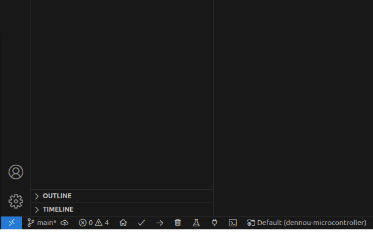

# Arduino言語での "Hello, World"とLEDの点滅

## Arduino言語の基本

まずは、Arduino言語のプログラムがどんな構造になっているか見てみましょう。
```cpp
void setup() {
    // 初期化処理
}

void loop() {
    // メインの処理
}
```

`setup()`関数はプログラムの最初に一度だけ実行される初期化処理を担当します。一方、`loop()`関数はプログラムが動いている間ずっと繰り返し実行されるメインの処理を書きます。C言語で例えると、こんな感じです。

```c
int main(){
        setup();
        while(1){
                loop();
        }
}
```

変数にはスコープがあるので、関数内で定義した変数はその関数の中だけで使えます。もし`setup()`で定義した変数を`loop()`でも使いたい場合は、グローバル変数として関数の外で定義する必要があります。

一般的にはグローバル変数はあまり使わない方がいいとされていますが、マイコンではメモリが限られているため、そこまで問題になることは少なくグローバル変数を使うこともよくあります。

では、実際にRaspberry Pi Picoを使って試してみましょう。基本的なソースコードは用意されているので、必要に応じて修正してみてください。

## Serial通信で "Hello, World" を表示してみよう

```cpp
void setup() {
    Serial.begin(115200);
}

void loop() {
    Serial.println("Hello, World!");
    delay(1000);
}
```

マイコンにはパソコンのような画面がないので、プログラムの実行結果を確認するには**Serial通信**（UARTとも呼ばれます）を使います。これは、マイコンとパソコンをUSBでつないで、シリアルポートを通じてデータをやり取りする方法です。

Arduinoでは、`Serial`クラスを使うことで簡単にシリアル通信ができます。まず、`Serial.begin(115200);`で通信を開始し、`Serial.println("Hello, World!");`でデータを送信します。

もし、通信ができない場合は、VSCodeの下の、シリアルポートを選択するところを確認してください(コネクタのマーク)。




<details>
<summary>Serial通信（UART）の詳細</summary>

UARTはTXとRXという2本の線でデータを送受信する通信方式です。USB接続の場合、TXとRXの信号線をUART-USB変換チップを通して通信します。Raspberry Pi Picoにはこの変換チップが内蔵されているので、USBケーブルをつなぐだけでUART通信が可能です。他のマイコンと通信する場合は、TXとRXの信号線を直接接続します。

UARTは歴史のある通信方式で、昔はRS-232Cという端子を使っていました。この方式は、大型コンピュータと端末（キーボードやディスプレイ）をつなぐのにも使われていました。
</details>

<details>
<summary>クラスとは</summary>

クラスは、データ（変数）とそのデータを操作する関数（メソッド）をひとまとめにした新しい変数のデータ型です。クラスを使うことで、プログラムを整理しやすくなります。

Arduinoの`Serial`クラスはその一例で、シリアル通信に必要なデータや操作をまとめています。例えば、UART通信では0と1のビット列でデータを送受信しますが、制御信号やデータのビット数、受信バッファなどを管理する必要があります。`Serial`クラスは、これらをひとまとめにして提供してくれます。

Arduinoには他にも便利なクラスが用意されています。例えば、センサとの通信に使う`Wire`クラスや、サーボモータを制御する`Servo`クラスなどがあります。これらを使えば、ハードウェアの操作が簡単にできます。
</details>

<details>
<summary>クラスの初期化</summary>

気づいた人もいるかもしれませんが、`Serial`クラスのインスタンスを自分で作っていませんよね。Arduinoでは、`Serial`クラスのインスタンスがあらかじめ用意されています。これは、Arduinoのライブラリが内部で`Serial`クラスのインスタンスを作成し、グローバル変数として提供しているからです。
</details>

## マイコンでLEDを点灯させてみよう

次はマイコンから物理的な対象を制御してみましょう。ここでは、LEDを点滅させてみます。
回路図は以下のようになります。


ソースコードです。
```cpp
#define LED_PIN 13

void setup() {
    pinMode(LED_PIN, OUTPUT); // LEDピンを出力モードに設定
}

void loop() {
    digitalWrite(LED_PIN, HIGH); // LEDを点灯
    delay(1000);                // 1秒待機
    digitalWrite(LED_PIN, LOW);  // LEDを消灯
    delay(1000);                // 1秒待機
}
```

このプログラムでは、`#define`を使ってLEDが接続されているピン番号を指定しています。`pinMode()`関数でそのピンを出力モードに設定し、`digitalWrite()`関数でピンの状態をHIGH（点灯）またはLOW（消灯）に切り替えます。

- `#define`の役割
    - `#define`は定数を定義するために使用されます。この例では、`LED_PIN`に13を割り当てています。これにより、コードの可読性が向上し、ピン番号の変更も簡単です。

- `pinMode()`関数
    `pinMode()`はピンの動作モードを設定します。
    - **OUTPUT**: 出力モード（例: LED制御）。
    - **INPUT**: 入力モード（例: センサ読み取り）。
    - **INPUT_PULLUP**: 内部プルアップ抵抗を有効にした入力モード。

- `digitalWrite()`関数
    - `digitalWrite()`はピンにHIGH（点灯）またはLOW（消灯）の信号を出力します。一度、HIGHにすると、そのままの電圧がかかり続けます。

- `delay()`関数
    - `delay()`は指定した**ミリ秒**だけ処理を停止します。


### LEDを暗くしたり明るくしたりしてみよう（PWM制御）
